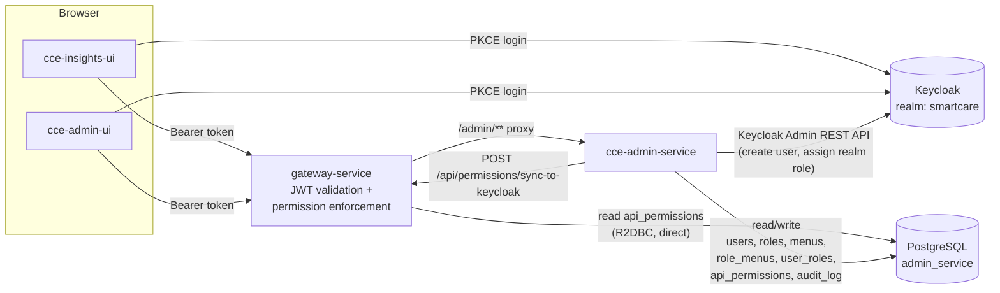

# Architecture Overview

## 1. Purpose

`cce-admin-service` is the user-management backend for the CCE platform. It owns three
things:

- **Users** who are allowed to sign in to `cce-insights-ui` (and future CCE consoles),
  backed by Keycloak identities.
- **Roles**, and which **menus** (nav items / screens of `cce-insights-ui`) and which
  **API permissions** each role grants.
- The **assignment** of roles to users, so that at login time a user sees only the
  menus their role permits, and the platform gateway only lets them call the APIs
  their role permits.

It does not own facility/clinical data, compliance metrics, or patient records — those
stay in their respective CCE services (`cce-compliance-service`, `cce-insights-service`,
etc.). It also does not perform authentication itself — Keycloak issues tokens, and
`gateway-service` validates them on every request. See [security-model.md](security-model.md)
for the full authentication/authorization split.

Terminology, schema, endpoints, and sequence details are intentionally kept out of this
document and linked instead, to avoid maintaining the same facts in two places:

| Topic | Document |
|---|---|
| Table/column definitions | [data-dictionary.md](data-dictionary.md) |
| Endpoint contracts | [api-reference.md](api-reference.md) |
| AuthN/AuthZ model, Keycloak & gateway integration | [security-model.md](security-model.md) |
| Step-by-step sequences (login, onboarding, role config) | [flow-diagrams.md](flow-diagrams.md) |

## 2. Core Concepts

| Term | Definition |
|---|---|
| **User** | A person who can sign in to a CCE console. Mirrored 1:1 with a Keycloak user. |
| **Role** | A named grouping of access (e.g. `FACILITY_ADMIN`, `NATIONAL_VIEWER`). A role's name is also its Keycloak realm role name and its `api_permissions.permission_name` — one identifier, not three (see [security-model.md](security-model.md#4-one-identifier-role--realm-role--permission_name)). |
| **Menu** | One navigable item/screen in `cce-insights-ui` (e.g. "Compliance", "Patients"). Controls what a role sees in the UI. |
| **Permission** | One `(HTTP method, URI pattern)` rule a role is allowed to call. Enforced by `gateway-service`, not by this service. |
| **Role → Menu mapping** | Governs UI visibility (soft control). |
| **Role → Permission mapping** | Governs actual API access (hard control, enforced at the gateway). |

These are deliberately two separate axes curated together for a role — see
[security-model.md](security-model.md#5-menus-vs-permissions-two-axes-one-role) for why
they aren't derived from one another in v1.

## 3. System Context



Key existing facts this design had to fit into (discovered from the sibling
`gateway-service` repo, which is already deployed and not being redesigned here):

- `gateway-service` already expects a Postgres database named **`admin_service`** and
  reads a table named **`api_permissions`** directly (R2DBC), to decide whether a
  request's Keycloak role may call a given `(method, URI)`.
- `gateway-service` already owns pushing role *definitions* into Keycloak as realm
  roles, via its own `POST /api/permissions/sync-to-keycloak` endpoint, sourced from
  that same `api_permissions` table.
- `gateway-service` extracts a caller's roles from a **configurable JWT claim path**
  (`jwt.roles-claim-path`, default `realm_access.roles`) — it is not hardcoded to
  realm-level roles only.
- `cce-insights-ui` currently has **no built-in RBAC** — it renders a static sidebar for
  every authenticated user and does not read roles/permissions from the token. Making
  the sidebar role-aware requires the frontend to call this service's
  `GET /me/menus` endpoint (see [api-reference.md](api-reference.md#get-memenus)) after
  login — that integration is a frontend change tracked alongside this service, not
  something `cce-admin-service` can force by itself.
- `cce-admin-ui` (the intended admin console for this service) does not exist yet
  (repo scaffold only) — this service's API contract is being designed contract-first,
  with no existing frontend to reverse-engineer.

Given this, `cce-admin-service` **owns the `admin_service` database** (including the
`api_permissions` table gateway already reads) and is responsible for keeping it and
Keycloak consistent. It does not duplicate the gateway's realm-role-provisioning logic —
it calls the gateway's existing sync endpoint after permission changes.

## 4. Technology Stack

Java/Spring Boot, aligned with `gateway-service` (Java 21, Spring, Keycloak Admin
Client) rather than with the Node-based `supporttool-service` — the two services share
the `admin_service` database and the Keycloak provisioning responsibility split
described in [security-model.md §6](security-model.md#6-keycloak-provisioning-who-does-what),
so keeping them in the same language/ecosystem outweighs matching a service
(`supporttool-service`) this one has no runtime relationship with.

| Concern | Choice | Notes |
|---|---|---|
| Language | Java 21 | Matches `gateway-service` |
| Framework | Spring Boot 3.x | |
| Web layer | Spring Web (Servlet MVC), blocking | `gateway-service` is reactive (WebFlux/R2DBC) because it's a high-throughput proxy; this is a low-throughput CRUD admin service, so plain Spring MVC is the simpler, more conventional fit — no shared runtime coupling to the gateway's reactive stack is required |
| Database | PostgreSQL, `admin_service` schema | Shared with `gateway-service` for `api_permissions` only — see [data-dictionary.md](data-dictionary.md#ownership-note). Gateway reads it via R2DBC; this service writes it via JPA — different drivers against the same tables is fine, there's no shared connection pool or code |
| DB access | Spring Data JPA + Hibernate | Standard Spring Boot pairing |
| Schema versioning | Flyway | Versioned, reviewable migrations under `src/main/resources/db/migration` |
| AuthN (resource server) | `spring-boot-starter-oauth2-resource-server` (Spring Security), JWKS-backed | Validates the same Keycloak-issued JWT independently of the gateway — defense in depth, not just network position. See [security-model.md §3](security-model.md#3-defense-in-depth-this-service-also-validates-the-jwt). |
| Keycloak admin operations | `org.keycloak:keycloak-admin-client` | Same library `gateway-service` already uses for its own Keycloak calls; create users, assign/remove realm roles, trigger password-reset actions |
| Logging | Logback (Spring Boot default) | |
| Audit trail | Custom `audit_log` table + write-through service | See [data-dictionary.md §7](data-dictionary.md#7-audit_log) |
| API docs | springdoc-openapi (OpenAPI 3 + Swagger UI), generated from the controllers described in [api-reference.md](api-reference.md) | This service is a shared dependency other teams integrate against, so a generated spec matters more here than for an internal-only service |
| Containerization | Docker, Maven-built jar, multi-stage image | Port **8085** (matches `gateway-service`'s existing `ADMIN_SERVICE_URI` default) |
| Build tool | Maven | |
| CI | Jenkins, same pipeline conventions as sibling services | |

## 5. Internal Layering

```
src/main/java/.../admin/
  controller/    # REST controllers — request/response DTOs, shapes the envelope, no business logic
  service/       # Business rules: role/menu/permission consistency, Keycloak orchestration
  repository/    # Spring Data JPA repositories, one per aggregate (User, Role, Menu, ApiPermission, AuditLog)
  entity/        # JPA entities mapping to the tables in data-dictionary.md
  security/      # Resource-server JWT validation config, method-level authorization
  client/        # Keycloak Admin Client wrapper, gateway-service sync-to-keycloak client
  audit/         # audit_log write-through service used after mutating calls
  config/        # Spring configuration (DataSource, Keycloak, WebClient/RestClient beans)
```

Standard Spring layering (`controller → service → repository`), with `security/`,
`client/`, and `audit/` broken out because this service's mutations routinely fan out
to Keycloak and to `gateway-service`'s sync endpoint in addition to the database —
keeping those side effects behind their own packages keeps controllers and repositories
free of anything but HTTP shaping and persistence, respectively.

## 6. Non-Functional Notes

- **Idempotency of Keycloak sync**: creating a user or assigning a role must be safe to
  retry (Keycloak calls can partially fail). Local DB writes and Keycloak calls are
  ordered and reconciled per the flows in [flow-diagrams.md](flow-diagrams.md).
- **Auditability**: every mutating admin action (user created/deactivated, role
  created/changed, role↔menu or role↔permission mapping changed) is written to
  `audit_log` — this platform's whole purpose is compliance, so who-changed-what-role
  must be reconstructable.
- **Pagination**: all list endpoints are paginated by default (see
  [api-reference.md](api-reference.md#pagination)).
- **Facility scoping**: `users.facility_scope` is a nullable foreign reference to
  facility/org master data owned by another CCE service (not duplicated here). It is
  carried as an optional attribute in v1; enforcing facility-scoped data access is out
  of scope for this service and left as a future extension point.

## 7. Deployment

- Listens on port `8085` by default (`server.port`, overridable via `SERVER_PORT`).
- Reached only through `gateway-service`'s `/admin/**` route in every non-local
  environment — it is not expected to be internet-facing directly.
- Configuration via `application.yml` with environment-variable placeholders (Spring's
  usual `${ENV_VAR}` relaxed binding): `DATABASE_URL`, `KEYCLOAK_BASE_URL`,
  `KEYCLOAK_REALM`, `KEYCLOAK_ADMIN_CLIENT_ID`/`_SECRET`, `GATEWAY_SERVICE_URL`,
  `JWT_ISSUER`, `JWT_AUDIENCE`, `JWT_ROLES_CLAIM_PATH` (kept consistent with the
  same-named settings in `gateway-service` so both services agree on how to read a
  token). None of these are committed; see [security-model.md §7](security-model.md#7-secrets)
  for handling.
