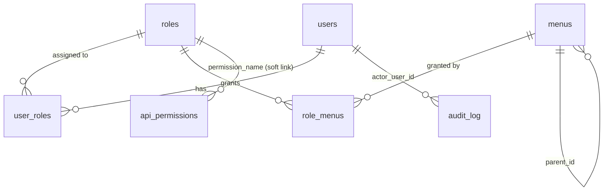

# Data Dictionary

Database: PostgreSQL, schema `admin_service` (name fixed by an existing consumer —
see the [ownership note](#ownership-note) under `api_permissions`).

All tables use `UUID` primary keys (`gen_random_uuid()`, via the `pgcrypto` extension)
and `created_at` / `updated_at` as `TIMESTAMPTZ NOT NULL DEFAULT now()` unless noted.
For why these entities exist and how they relate, see
[architecture-overview.md §2](architecture-overview.md#2-core-concepts). For how they're
read/written over HTTP, see [api-reference.md](api-reference.md). For enforcement
semantics, see [security-model.md](security-model.md).

## Entity-Relationship Summary

## 1. `users`

One row per person who can sign in to a CCE console. Mirrors a Keycloak user; this
service does not store credentials.

| Column | Type | Constraints | Notes |
|---|---|---|---|
| `id` | UUID | PK | |
| `keycloak_id` | UUID | UNIQUE, NOT NULL | Keycloak `sub` claim — the join key between a token and this row |
| `username` | VARCHAR(100) | UNIQUE, NOT NULL | Mirrors Keycloak username |
| `email` | VARCHAR(255) | UNIQUE, NOT NULL | |
| `first_name` | VARCHAR(100) | NOT NULL | |
| `last_name` | VARCHAR(100) | NOT NULL | |
| `status` | VARCHAR(20) | NOT NULL, DEFAULT `'ACTIVE'`, CHECK IN (`ACTIVE`,`INACTIVE`,`LOCKED`) | `INACTIVE`/`LOCKED` also disables the user in Keycloak — see [security-model.md](security-model.md) |
| `facility_scope` | VARCHAR(50) | NULL | Optional facility/org code from external master data (not owned here); `NULL` = unscoped/national access |
| `last_login_at` | TIMESTAMPTZ | NULL | Updated by a lightweight callback, not polled |
| `created_by` | UUID | NULL, FK → `users.id` | Null for the seed super-admin |
| `created_at` / `updated_at` | TIMESTAMPTZ | NOT NULL | |

Deletion is **soft**: there is no hard-delete path in the API. `status='INACTIVE'` is
the terminal state, kept for audit continuity (see [architecture-overview.md §6](architecture-overview.md#6-non-functional-notes)).

## 2. `roles`

A named grouping of access. See [security-model.md §4](security-model.md#4-one-identifier-role--realm-role--permission_name)
for why `name` is shared across three systems instead of being three separate IDs.

| Column | Type | Constraints | Notes |
|---|---|---|---|
| `id` | UUID | PK | |
| `name` | VARCHAR(100) | UNIQUE, NOT NULL | e.g. `FACILITY_ADMIN`. Also the Keycloak realm role name and `api_permissions.permission_name` value. Convention: `UPPER_SNAKE_CASE`. |
| `display_name` | VARCHAR(150) | NOT NULL | e.g. "Facility Admin" |
| `description` | TEXT | NULL | |
| `is_system` | BOOLEAN | NOT NULL, DEFAULT `false` | `true` for seeded roles (e.g. `SUPER_ADMIN`) that cannot be deleted or renamed |
| `created_by` | UUID | NULL, FK → `users.id` | |
| `created_at` / `updated_at` | TIMESTAMPTZ | NOT NULL | |

A role cannot be deleted while any row references it in `user_roles` (enforced at the
service layer with a clear error, not left to a DB FK violation).

## 3. `menus`

One navigable item/screen of `cce-insights-ui`. Seeded from the frontend's current
navigation (see [flow-diagrams.md](flow-diagrams.md) seed list); extended over time as
the frontend grows.

| Column | Type | Constraints | Notes |
|---|---|---|---|
| `id` | UUID | PK | |
| `key` | VARCHAR(100) | UNIQUE, NOT NULL | Stable machine key, e.g. `compliance.patients` |
| `label` | VARCHAR(150) | NOT NULL | Display label, e.g. "Patients" |
| `path` | VARCHAR(255) | NOT NULL | Frontend route, e.g. `/compliance/patients` |
| `icon` | VARCHAR(100) | NULL | Icon identifier used by the frontend (e.g. Heroicons name) |
| `parent_id` | UUID | NULL, FK → `menus.id` | Self-reference for hierarchy (e.g. "Patients" under "Compliance") |
| `menu_type` | VARCHAR(20) | NOT NULL, DEFAULT `'NAV'`, CHECK IN (`NAV`,`DETAIL`) | `NAV` = shown in the sidebar; `DETAIL` = drill-down route that inherits its parent's visibility and isn't listed independently in the sidebar |
| `sort_order` | INT | NOT NULL, DEFAULT `0` | Sidebar ordering among siblings |
| `is_active` | BOOLEAN | NOT NULL, DEFAULT `true` | Soft-disable a menu without deleting mapping history |
| `created_at` / `updated_at` | TIMESTAMPTZ | NOT NULL | |

Initial seed data (from the current `cce-insights-ui` sidebar and drill-down routes):

| key | label | path | menu_type | parent |
|---|---|---|---|---|
| `dashboard` | Dashboard | `/` | NAV | — |
| `facilities` | Facilities | `/facilities` | NAV | — |
| `compliance` | Compliance | `/compliance` | NAV | — |
| `compliance.protocol_detail` | Protocol Detail | `/compliance/protocols/:id` | DETAIL | `compliance` |
| `compliance.patients` | Patients | `/compliance/patients` | NAV | — |
| `compliance.patients.detail` | Patient Detail | `/compliance/patients/:id` | DETAIL | `compliance.patients` |
| `deviations` | Deviations | `/deviations` | NAV | — |
| `events` | Events | `/events` | NAV | — |
| `ingestion` | Ingestion | `/ingestion` | NAV | — |
| `practitioners` | Practitioners | `/practitioners` | NAV | — |
| `intelligence` | Intelligence | `/intelligence` | NAV | — |
| `exports` | Exports | `/exports` | NAV | — |

`Patients` is modeled as its own top-level menu (it already has its own route,
`/compliance/patients`, distinct from `/compliance`) even though the current sidebar
nests it visually under Compliance — this lets a role see Patients without seeing the
full Compliance dashboard, or vice versa.

## 4. `role_menus`

Many-to-many: which menus a role's users may see.

| Column | Type | Constraints | Notes |
|---|---|---|---|
| `role_id` | UUID | PK (composite), FK → `roles.id` ON DELETE CASCADE | |
| `menu_id` | UUID | PK (composite), FK → `menus.id` ON DELETE CASCADE | |
| `created_at` | TIMESTAMPTZ | NOT NULL | |

Granting a `DETAIL` menu without its parent `NAV` menu is permitted at the schema level
but flagged as a validation warning at the service layer (a detail route a user can open
directly but whose parent list they can't see is almost always a configuration mistake).

## 5. `user_roles`

Many-to-many: which roles a user has.

| Column | Type | Constraints | Notes |
|---|---|---|---|
| `user_id` | UUID | PK (composite), FK → `users.id` ON DELETE CASCADE | |
| `role_id` | UUID | PK (composite), FK → `roles.id` ON DELETE CASCADE | |
| `assigned_by` | UUID | NULL, FK → `users.id` | |
| `assigned_at` | TIMESTAMPTZ | NOT NULL, DEFAULT `now()` | |

Normalized join table (deliberately not the integer-array-column pattern seen in
`supporttool-service.user_roles` — that shape makes indexing and referential integrity
harder; a standard join table was chosen instead since this service's whole purpose is
this mapping).

## 6. `api_permissions`

### Ownership note

This table's shape is **not free to redesign** — `gateway-service` already reads it
directly (R2DBC) at startup and on manual sync to decide whether a caller's role may
invoke a given `(HTTP method, URI pattern)`. `cce-admin-service` owns writes to this
table (via role-permission management endpoints); `gateway-service` owns reads and owns
pushing distinct `permission_name` values into Keycloak as realm roles. Column names
below match the existing consumer; confirm exact types against `gateway-service`'s own
`DATABASE_PERMISSIONS_MIGRATION.md` before altering this table, since a mismatch breaks
a service this repo does not control.

| Column | Type | Constraints | Notes |
|---|---|---|---|
| `id` | UUID | PK | |
| `permission_name` | VARCHAR(150) | NOT NULL | Equals `roles.name` — see [security-model.md §4](security-model.md#4-one-identifier-role--realm-role--permission_name) |
| `http_method` | VARCHAR(10) | NOT NULL | `GET` \| `POST` \| `PUT` \| `PATCH` \| `DELETE` \| `*` |
| `uri_pattern` | VARCHAR(255) | NOT NULL | Ant-style path pattern, e.g. `/v1/insights/compliance/**` |
| `description` | TEXT | NULL | |
| `resource_category` | VARCHAR(100) | NULL | Grouping label shown in admin UI, e.g. "Compliance API" |
| `created_at` / `updated_at` | TIMESTAMPTZ | NOT NULL | |

## 7. `audit_log`

Append-only. Written by the service layer after every mutating admin action.

| Column | Type | Constraints | Notes |
|---|---|---|---|
| `id` | UUID | PK | |
| `actor_user_id` | UUID | NULL, FK → `users.id` | Null only for system/seed actions |
| `action` | VARCHAR(100) | NOT NULL | e.g. `USER_CREATED`, `USER_DEACTIVATED`, `ROLE_CREATED`, `ROLE_MENUS_UPDATED`, `ROLE_PERMISSIONS_UPDATED`, `USER_ROLES_UPDATED` |
| `entity_type` | VARCHAR(50) | NOT NULL | `USER` \| `ROLE` \| `MENU` \| `API_PERMISSION` |
| `entity_id` | UUID | NULL | |
| `before_state` | JSONB | NULL | Omitted fields: none redacted at this layer — do not log credentials here (there are none to log) |
| `after_state` | JSONB | NULL | |
| `ip_address` | VARCHAR(64) | NULL | |
| `created_at` | TIMESTAMPTZ | NOT NULL | |

## Indexes

- `users(keycloak_id)`, `users(email)`, `users(status)`
- `menus(parent_id)`
- `role_menus(menu_id)` (role_id already covered by the composite PK)
- `user_roles(role_id)` (user_id already covered by the composite PK)
- `api_permissions(permission_name)`
- `audit_log(actor_user_id, created_at)`, `audit_log(entity_type, entity_id)`
