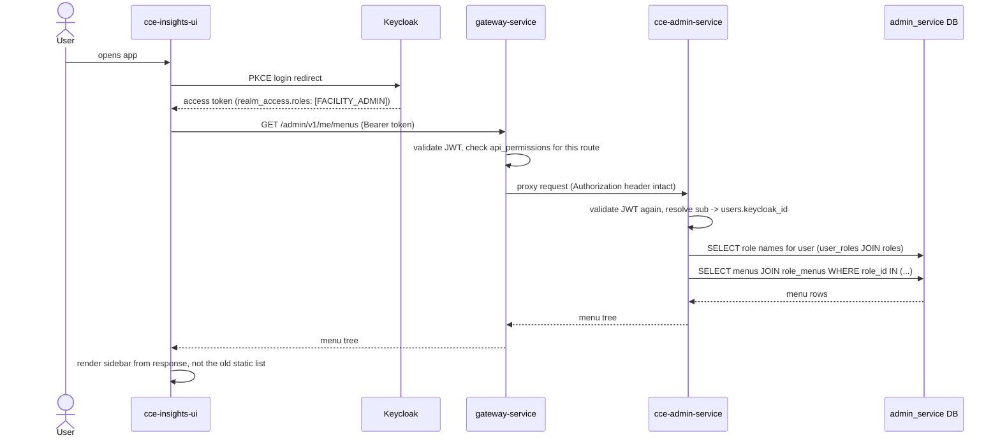
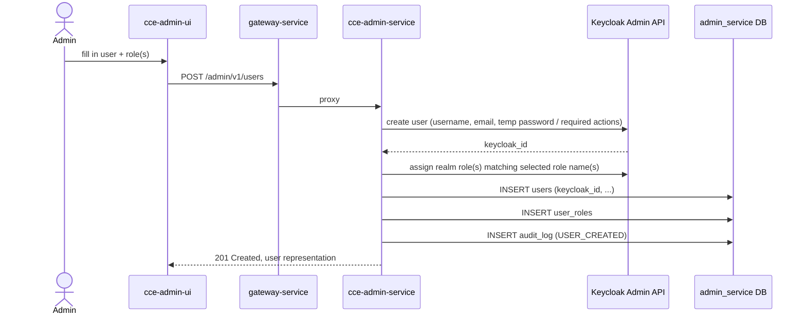
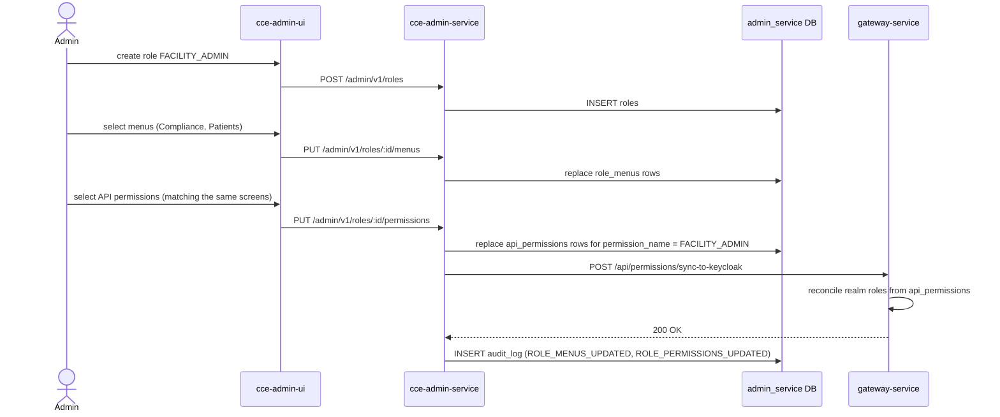
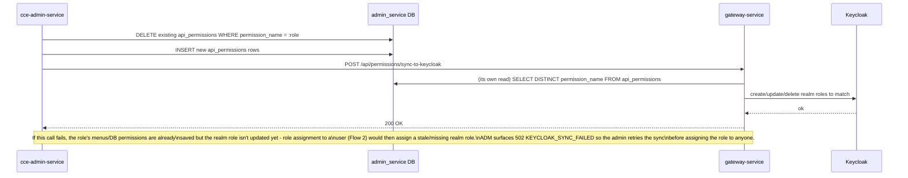
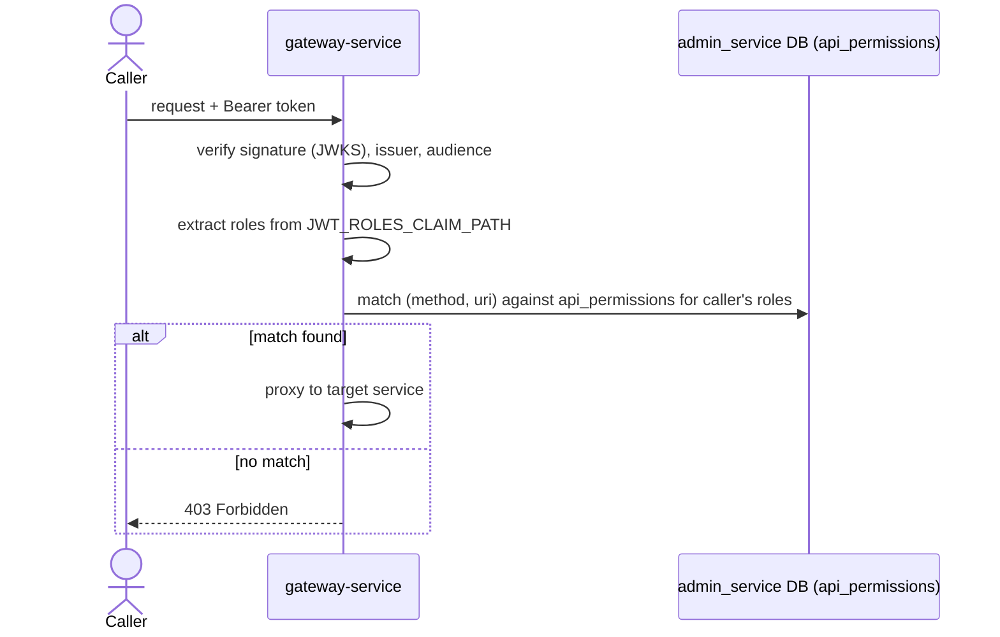
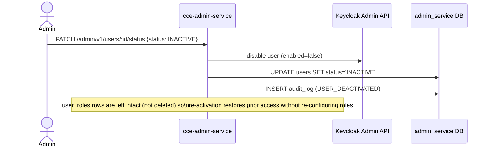

# Flow Diagrams

Sequence-level detail for the scenarios referenced elsewhere. Entity/column names per
[data-dictionary.md](data-dictionary.md); endpoint names per
[api-reference.md](api-reference.md); the reasoning behind the split of
responsibilities shown here lives in [security-model.md](security-model.md).

## 1. Login and role-aware menu resolution

The scenario that motivates this whole service: a user logs in and sees only their
role's menus.

## 2. Admin onboards a new user

If the Keycloak create succeeds but the local insert fails, the endpoint responds
`502 KEYCLOAK_SYNC_FAILED` with the Keycloak `keycloak_id` recorded in the audit entry so
the orphaned Keycloak account can be reconciled by hand rather than retried blindly (a
blind retry risks a second Keycloak account for the same person).

## 3. Admin configures a role

Shows why menus and permissions are set together even though they're independent axes
(see [security-model.md §5](security-model.md#5-menus-vs-permissions-two-axes-one-role)).

## 4. Admin updates a role's API permissions

Detail on the sync-ordering referenced in
[security-model.md §6](security-model.md#6-keycloak-provisioning-who-does-what): the
realm role definition must exist in Keycloak *before* any user is assigned it, so the
sync call happens as part of the permission update, not deferred.

## 5. Gateway request authorization (existing behavior, shown for context)

Not implemented by this service — included because every write in flows 2-4 is only
reachable through this check.

## 6. User deactivation

