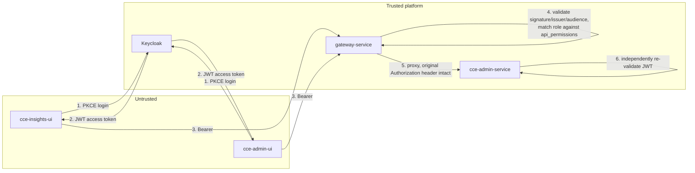

# Security Model

This document covers authentication, authorization, and Keycloak/gateway integration.
For entity definitions see [architecture-overview.md §2](architecture-overview.md#2-core-concepts);
for schema see [data-dictionary.md](data-dictionary.md); for endpoint-level detail see
[api-reference.md](api-reference.md).

## 1. Actors and Trust Boundary

Neither frontend ever holds a Keycloak admin credential or talks to this service's
database. Every write to `users`, `roles`, `menus`, or `api_permissions` goes through
`cce-admin-service`'s HTTP API, fronted by `gateway-service`.

## 2. Token Issuance (unchanged, frontend-owned)

`cce-insights-ui` and `cce-admin-ui` authenticate directly against Keycloak using
Authorization Code + PKCE (`keycloak-js`). `cce-admin-service` does not participate in
login and does not see credentials — it only ever sees the resulting bearer token.

## 3. Defense in depth: this service also validates the JWT

`gateway-service` already validates every request's JWT (signature via JWKS, issuer,
audience) before proxying to `/admin/**`. `cce-admin-service` validates the same token
again on every request rather than trusting network position alone:

- Fetch/cache JWKS from `${KEYCLOAK_BASE_URL}/realms/${KEYCLOAK_REALM}/protocol/openid-connect/certs`.
- Verify signature, `iss` (`JWT_ISSUER`), `aud` (`JWT_AUDIENCE`), and expiry.
- Extract the caller's roles from `JWT_ROLES_CLAIM_PATH` (default `realm_access.roles`,
  dot-notation) — **kept configurable and defaulted identically to `gateway-service`**,
  so both services agree on where roles live in the token without needing to ask each
  other.
- Resolve `sub` → `users.keycloak_id` to load the local user row (status, facility
  scope, etc.). A valid token for a `keycloak_id` with no matching local user, or with
  `status != 'ACTIVE'`, is rejected with `403` even though the token itself is valid —
  Keycloak validity and local account standing are checked independently.

This is standard resource-server practice, not a workaround for a gap in the gateway.

## 4. One identifier: role == realm role == `permission_name`

A role created in `cce-admin-service` (`roles.name`) is used, unchanged, as:

1. The Keycloak **realm role name** assigned to users who hold that role.
2. The `api_permissions.permission_name` value the gateway matches against a caller's
   roles claim to authorize an API call.

This is a deliberate simplification, not an oversight: `gateway-service` already treats
"a role the caller holds" and "a permission name" as the same string (see
[architecture-overview.md §3](architecture-overview.md#3-system-context)) — introducing
a separate fine-grained "permission" concept distinct from "role" would require
translating between two identifier spaces for no benefit, since nothing downstream
consumes a finer grain than role today. If a future requirement needs
finer-than-role permissions, that's an additive change (a `permissions` table between
`roles` and `api_permissions`), not a breaking one.

Naming convention: `UPPER_SNAKE_CASE` (e.g. `FACILITY_ADMIN`), matching existing realm
role examples (`INSIGHTS_READ`) seen in the gateway's configuration.

## 5. Menus vs. permissions: two axes, one role

| | Menus | Permissions |
|---|---|---|
| Controls | What the frontend renders | What the gateway will proxy |
| Enforced by | `cce-admin-service` (`GET /me/menus`) | `gateway-service` (`api_permissions` match) |
| Failure mode if wrong | Cosmetic — a menu item that 404s or a missing item | Security — an actual unauthorized API call, or a blocked legitimate one |

They are **not derived from one another** in v1: granting a role the "Compliance" menu
does not automatically grant it the API permissions to call the compliance endpoints,
and vice versa. This is intentional — a menu item can legitimately call several
different downstream APIs, and an API permission can be needed without a corresponding
menu (e.g. a background export job's service account). Keeping them independent avoids
guessing a mapping that doesn't hold in every case. The cost is that whoever configures
a role must set both; the [flow-diagrams.md](flow-diagrams.md#3-admin-configures-a-role)
sequence shows both steps happening together in the same admin workflow so this isn't
easy to forget. Deriving a default permission set from a menu selection is a reasonable
v2 enhancement once real usage shows a stable pattern.

## 6. Keycloak provisioning: who does what

To avoid duplicating logic that `gateway-service` already has (realm-role
creation/deletion from `api_permissions`), responsibilities are split:

| Responsibility | Owner |
|---|---|
| Create/delete the **realm role definition** for each distinct role name | `gateway-service`, via its existing `POST /api/permissions/sync-to-keycloak`, sourced from `api_permissions` |
| Create the **Keycloak user account** for a new `cce-admin-service` user | `cce-admin-service`, via Keycloak Admin REST API |
| **Assign/remove a realm role on a specific user** (mirroring `user_roles`) | `cce-admin-service`, via Keycloak Admin REST API |
| Trigger **password reset** / required actions | `cce-admin-service`, via Keycloak Admin REST API |

After `cce-admin-service` changes a role's `api_permissions` rows, it calls
`gateway-service`'s `POST /api/permissions/sync-to-keycloak` so the realm role
definition exists before it's assigned to any user. See
[flow-diagrams.md §4](flow-diagrams.md#4-admin-updates-a-roles-api-permissions) for the
ordering.

## 7. Secrets

Not committed to this repo. Provided via environment/secret store per environment:

- `DATABASE_URL` — Postgres connection string for the `admin_service` database.
- `KEYCLOAK_ADMIN_CLIENT_ID` / `KEYCLOAK_ADMIN_CLIENT_SECRET` — service account with
  `manage-users` and `manage-realm` (roles) permissions in the target realm, scoped as
  narrowly as Keycloak allows (not the `master` realm admin used in local dev).
  Local/dev defaults referenced in `gateway-service` (`admin`/`admin123` against
  `master`) are **not** to be reused in any shared or production environment.
- `GATEWAY_SERVICE_URL` — base URL used only for the sync-to-keycloak call.
- `JWT_ISSUER`, `JWT_AUDIENCE`, `JWT_ROLES_CLAIM_PATH` — must match `gateway-service`'s
  configuration for the same realm/client.

## 8. Audit

Every mutating endpoint writes an `audit_log` row (actor, action, before/after state) —
see [data-dictionary.md §7](data-dictionary.md#7-audit_log). This is what makes "who
gave this user access to Patients, and when" answerable, which is the point of a
compliance-oriented platform.
